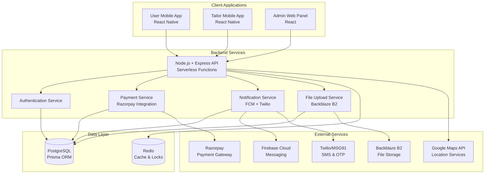
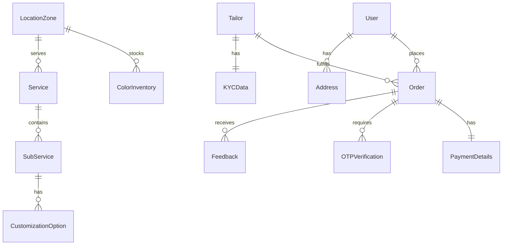

# Design Document: Tailor Booking Platform

## Overview

The Tailor Booking Platform is a comprehensive multi-client system that connects users with professional tailors through a unified backend infrastructure. The platform consists of three client applications: User Mobile App (React Native), Tailor Mobile App (React Native), and Admin Web Panel (React), all consuming a shared Node.js + Express backend with PostgreSQL database and Redis caching.

The system handles the complete service lifecycle from user registration to service completion, featuring OTP-based authentication, location-based service matching, real-time slot management with Redis locks, payment processing through Razorpay, and comprehensive order tracking with push notifications via Firebase Cloud Messaging.

## Architecture

### System Architecture



### Technology Stack

- **Frontend**: React Native (Mobile), React (Admin Panel)
- **Backend**: Node.js + Express (Serverless on Vercel)
- **Database**: PostgreSQL with Prisma ORM
- **Cache/Locks**: Redis for session management and slot locking
- **File Storage**: Backblaze B2 for images and documents
- **Payments**: Razorpay integration
- **Notifications**: Firebase Cloud Messaging + Twilio/MSG91
- **Maps**: Google Maps API
- **Deployment**: Vercel for all components
- **CI/CD**: GitHub Actions

## Components and Interfaces

### Authentication Service

**Purpose**: Handles OTP-based authentication for all user types

**Key Components**:
- `OTPManager`: Generates and validates OTPs with expiration
- `SessionManager`: Manages user sessions with Redis
- `UserRegistration`: Handles new user onboarding
- `KYCProcessor`: Manages tailor verification workflow

**Interfaces**:
```typescript
interface AuthService {
  sendOTP(phoneNumber: string, userType: 'user' | 'tailor'): Promise<{success: boolean, otpId: string}>
  verifyOTP(otpId: string, otp: string): Promise<{success: boolean, token: string, isNewUser: boolean}>
  validateSession(token: string): Promise<{valid: boolean, userId: string, userType: string}>
  refreshToken(token: string): Promise<{success: boolean, newToken: string}>
}

interface KYCService {
  submitKYC(tailorId: string, kycData: KYCData): Promise<{success: boolean, kycId: string}>
  updateKYCStatus(kycId: string, status: 'approved' | 'rejected', reason?: string): Promise<boolean>
  getKYCStatus(tailorId: string): Promise<{status: string, reason?: string}>
}
```

### Location and Service Discovery

**Purpose**: Manages location-based service availability and tailor matching

**Key Components**:
- `LocationManager`: Handles GPS and manual location input
- `ServiceCatalog`: Manages service and sub-service definitions
- `AvailabilityChecker`: Determines service availability by location
- `TailorMatcher`: Assigns tailors based on location and availability

**Interfaces**:
```typescript
interface LocationService {
  getCurrentLocation(): Promise<{latitude: number, longitude: number}>
  geocodeAddress(address: string): Promise<{latitude: number, longitude: number}>
  getLocationZone(coordinates: {latitude: number, longitude: number}): Promise<string>
  getServicesInZone(zoneId: string): Promise<Service[]>
}

interface ServiceCatalog {
  getServices(zoneId: string): Promise<Service[]>
  getSubServices(serviceId: string): Promise<SubService[]>
  getServiceDetails(subServiceId: string): Promise<ServiceDetails>
  getCustomizationOptions(subServiceId: string): Promise<CustomizationOption[]>
}
```

### Booking and Slot Management

**Purpose**: Handles slot reservation, tailor assignment, and booking confirmation

**Key Components**:
- `SlotManager`: Manages time-based availability slots
- `RedisLockManager`: Implements distributed locking for slot reservation
- `TailorAssignment`: Automatically assigns available tailors
- `BookingProcessor`: Coordinates the complete booking flow

**Interfaces**:
```typescript
interface SlotManager {
  getAvailableSlots(zoneId: string, date: Date): Promise<TimeSlot[]>
  reserveSlot(slotId: string, userId: string): Promise<{success: boolean, lockId: string}>
  confirmSlot(lockId: string, orderId: string): Promise<boolean>
  releaseSlot(lockId: string): Promise<boolean>
}

interface BookingService {
  createBooking(bookingData: BookingData): Promise<{success: boolean, orderId: string}>
  calculatePrice(serviceId: string, customizations: Customization[]): Promise<number>
  processPayment(orderId: string, paymentData: PaymentData): Promise<{success: boolean, paymentId: string}>
}
```

### Payment Processing

**Purpose**: Integrates with Razorpay for payment processing and manages commission distribution

**Key Components**:
- `RazorpayIntegration`: Handles payment gateway communication
- `PaymentProcessor`: Manages payment lifecycle
- `CommissionCalculator`: Calculates platform fees
- `PayoutManager`: Handles tailor payments with hold periods

**Interfaces**:
```typescript
interface PaymentService {
  createPaymentOrder(amount: number, orderId: string): Promise<{razorpayOrderId: string}>
  verifyPayment(paymentId: string, orderId: string, signature: string): Promise<boolean>
  processRefund(paymentId: string, amount: number, reason: string): Promise<{success: boolean, refundId: string}>
  holdPayment(orderId: string, duration: number): Promise<boolean>
  releasePayment(orderId: string): Promise<{success: boolean, payoutId: string}>
}
```

### Order Management

**Purpose**: Manages complete order lifecycle from creation to completion

**Key Components**:
- `OrderProcessor`: Handles order creation and updates
- `StatusTracker`: Manages order status transitions
- `OTPVerification`: Handles service start/completion verification
- `FeedbackManager`: Collects and processes user feedback

**Interfaces**:
```typescript
interface OrderService {
  createOrder(orderData: OrderData): Promise<{success: boolean, orderId: string}>
  updateOrderStatus(orderId: string, status: OrderStatus, metadata?: any): Promise<boolean>
  getOrderDetails(orderId: string): Promise<OrderDetails>
  getUserOrders(userId: string, status?: OrderStatus): Promise<Order[]>
  getTailorOrders(tailorId: string, status?: OrderStatus): Promise<Order[]>
}

interface OTPVerificationService {
  generateServiceOTP(orderId: string, type: 'start' | 'complete'): Promise<{otp: string, otpId: string}>
  verifyServiceOTP(otpId: string, otp: string): Promise<{success: boolean, orderId: string}>
}
```

### Inventory Management

**Purpose**: Manages fabric inventory and color matching across location zones

**Key Components**:
- `InventoryManager`: Tracks fabric availability by location
- `ColorDetection`: Processes uploaded images for color matching
- `ColorMatcher`: Matches detected colors with available inventory
- `StockUpdater`: Updates inventory quantities on order confirmation

**Interfaces**:
```typescript
interface InventoryService {
  getAvailableColors(zoneId: string): Promise<ColorInventory[]>
  detectFabricColor(imageUrl: string): Promise<{color: string, confidence: number}>
  findColorMatches(detectedColor: string, zoneId: string): Promise<ColorMatch[]>
  reserveInventory(zoneId: string, colorId: string, quantity: number): Promise<boolean>
  updateStock(zoneId: string, colorId: string, quantity: number): Promise<boolean>
}
```

### Notification System

**Purpose**: Handles push notifications and SMS communication

**Key Components**:
- `FCMManager`: Manages Firebase Cloud Messaging
- `SMSProvider`: Integrates with Twilio/MSG91 for SMS
- `NotificationQueue`: Queues and processes notifications
- `TemplateManager`: Manages notification templates

**Interfaces**:
```typescript
interface NotificationService {
  sendPushNotification(userId: string, title: string, body: string, data?: any): Promise<boolean>
  sendSMS(phoneNumber: string, message: string): Promise<{success: boolean, messageId: string}>
  sendOrderNotification(orderId: string, type: NotificationType): Promise<boolean>
  registerDeviceToken(userId: string, token: string, platform: 'ios' | 'android'): Promise<boolean>
}
```

## Data Models

### Core Entity Models

```typescript
// User Management
interface User {
  id: string
  phoneNumber: string
  name: string
  email?: string
  gender: 'male' | 'female' | 'other'
  profileImage?: string
  redeemCode?: string
  createdAt: Date
  updatedAt: Date
  addresses: Address[]
  orders: Order[]
}

interface Tailor {
  id: string
  phoneNumber: string
  name: string
  email: string
  age: number
  profileImage: string
  kycStatus: 'pending' | 'approved' | 'rejected'
  kycData: KYCData
  isAvailable: boolean
  locationZones: string[]
  rating: number
  totalOrders: number
  earnings: number
  createdAt: Date
  updatedAt: Date
}

interface KYCData {
  aadhaarNumber: string
  aadhaarFrontImage: string
  aadhaarBackImage: string
  panNumber: string
  panFrontImage: string
  panBackImage: string
  verificationStatus: 'pending' | 'approved' | 'rejected'
  rejectionReason?: string
  verifiedAt?: Date
}

// Service Management
interface Service {
  id: string
  name: string
  description: string
  category: string
  basePrice: number
  estimatedTime: number
  isActive: boolean
  availableZones: string[]
  subServices: SubService[]
}

interface SubService {
  id: string
  serviceId: string
  name: string
  description: string
  basePrice: number
  estimatedTime: number
  customizationOptions: CustomizationOption[]
}

interface CustomizationOption {
  id: string
  name: string
  type: 'single' | 'multiple'
  options: CustomizationChoice[]
  isRequired: boolean
}

interface CustomizationChoice {
  id: string
  name: string
  priceModifier: number
  previewImage?: string
}

// Order Management
interface Order {
  id: string
  userId: string
  tailorId: string
  serviceId: string
  subServiceId: string
  customizations: SelectedCustomization[]
  measurements?: Measurement[]
  referenceImages: string[]
  fabricColor: string
  scheduledDate: Date
  scheduledTime: string
  location: Address
  status: OrderStatus
  pricing: OrderPricing
  payment: PaymentDetails
  otpVerifications: OTPVerification[]
  feedback?: Feedback
  createdAt: Date
  updatedAt: Date
}

type OrderStatus = 
  | 'pending_payment'
  | 'confirmed'
  | 'tailor_assigned'
  | 'in_progress'
  | 'completed'
  | 'cancelled'
  | 'refunded'

interface OrderPricing {
  basePrice: number
  customizationCost: number
  taxes: number
  totalAmount: number
  platformCommission: number
  tailorEarnings: number
}

// Location and Inventory
interface Address {
  id: string
  userId: string
  type: 'home' | 'work' | 'other'
  addressLine1: string
  addressLine2?: string
  city: string
  state: string
  pincode: string
  latitude: number
  longitude: number
  zoneId: string
}

interface ColorInventory {
  id: string
  zoneId: string
  colorName: string
  colorCode: string
  hexValue: string
  availableQuantity: number
  reservedQuantity: number
  isActive: boolean
}

// Payment and Transactions
interface PaymentDetails {
  id: string
  orderId: string
  razorpayOrderId: string
  razorpayPaymentId?: string
  amount: number
  status: 'pending' | 'completed' | 'failed' | 'refunded'
  method: 'upi' | 'card' | 'netbanking'
  holdUntil?: Date
  releasedAt?: Date
  refundId?: string
  createdAt: Date
}
```

### Database Schema Relationships



## Correctness Properties

*A property is a characteristic or behavior that should hold true across all valid executions of a system—essentially, a formal statement about what the system should do. Properties serve as the bridge between human-readable specifications and machine-verifiable correctness guarantees.*

<function_calls>
<invoke name="prework">
<parameter name="featureName">tailor-booking-platform

### Property Reflection

After reviewing all properties identified in the prework analysis, I've identified several areas where properties can be consolidated to eliminate redundancy:

**Consolidation Opportunities:**
- Properties 1.2 and 1.3 (OTP sending and verification) can be combined into a comprehensive OTP round-trip property
- Properties 4.2 and 4.3 (price updates and price impact display) can be combined into a single pricing consistency property
- Properties 6.1, 6.2, 6.3, 6.4, and 6.5 (color detection and inventory matching) can be consolidated into fewer comprehensive properties
- Properties 10.1, 10.2, 10.3, and 10.4 (OTP verification for service execution) can be combined into service OTP workflow properties
- Properties 15.1 and 15.2 (push and SMS notifications) can be combined into a comprehensive notification delivery property

**Retained Properties:**
Each remaining property provides unique validation value and cannot be subsumed by others.

### Correctness Properties

Property 1: OTP Authentication Round Trip
*For any* valid phone number and generated OTP, the complete authentication flow (send OTP → verify OTP → grant access) should complete successfully within the specified time limits
**Validates: Requirements 1.2, 1.3**

Property 2: User Type Profile Flow
*For any* authenticated user, first-time users should be required to complete profile creation while returning users should be redirected directly to dashboard
**Validates: Requirements 1.4, 1.5**

Property 3: Location Detection and Persistence
*For any* user granting location permission, the system should detect coordinates within 10 seconds and use this location consistently across all location-dependent features
**Validates: Requirements 2.2, 2.4, 2.5**

Property 4: Manual Location Processing
*For any* manually entered address, the system should successfully geocode it to coordinates and map it to the appropriate service zone
**Validates: Requirements 2.3**

Property 5: Service Selection Constraints
*For any* order creation attempt, the system should enforce exactly one service selection and prevent multiple service bookings in a single order
**Validates: Requirements 3.4**

Property 6: Service Information Completeness
*For any* service or sub-service selection, the system should display all required information (pricing, time estimates, descriptions) and provide appropriate navigation options
**Validates: Requirements 3.2, 3.3, 3.5**

Property 7: Dynamic Pricing Consistency
*For any* customization selection, the system should update pricing immediately and display the price impact for each option while maintaining pricing accuracy
**Validates: Requirements 4.2, 4.3**

Property 8: Customization Persistence
*For any* service customization flow, all selected options should be saved and available for order processing, with service-specific forms displayed appropriately
**Validates: Requirements 4.1, 4.5**

Property 9: Measurement System Flexibility
*For any* user interaction with measurements, the system should support both new entry and selection from saved measurements, with optional requirements based on service type
**Validates: Requirements 5.1, 5.3, 5.5**

Property 10: Image Upload Validation
*For any* image upload attempt, the system should validate format (JPEG/PNG) and size (≤10MB) constraints while supporting multiple reference images
**Validates: Requirements 5.2, 5.4**

Property 11: Color Detection and Inventory Matching
*For any* fabric image upload, the system should attempt color detection, match against zone inventory, prioritize exact matches, recommend alternatives when needed, and always display all available options
**Validates: Requirements 6.1, 6.2, 6.3, 6.4, 6.5**

Property 12: Slot Reservation and Locking
*For any* slot selection, the system should reserve it for exactly 5 minutes, assign an available tailor automatically, and prevent double booking
**Validates: Requirements 7.1, 7.2, 7.3**

Property 13: Tailor Assignment Constraints
*For any* tailor assignment, the system should ensure one tailor handles only one order at a time and hide tailor identity from users during booking
**Validates: Requirements 7.4, 7.5**

Property 14: Payment Processing Completeness
*For any* payment attempt, the system should display complete price breakdown, support required payment methods, and process within 30 seconds
**Validates: Requirements 8.1, 8.2, 8.5**

Property 15: Payment Success and Failure Handling
*For any* payment outcome, successful payments should create orders and update inventory while failed payments should release slots and restore tailor availability
**Validates: Requirements 8.3, 8.4**

Property 16: Order Management and Tracking
*For any* order, the system should categorize it correctly, display complete details, support cancellation per policy, provide real-time updates, and maintain history
**Validates: Requirements 9.1, 9.2, 9.3, 9.4, 9.5**

Property 17: Service Execution OTP Workflow
*For any* service execution, the system should generate and verify OTPs for both service start and completion, updating order status appropriately, with admin override capability for failures
**Validates: Requirements 10.1, 10.2, 10.3, 10.4, 10.5**

Property 18: Tailor Registration and KYC Flow
*For any* tailor registration, the system should require phone verification, enforce KYC submission with all required documents, set appropriate approval status, and restrict access until approval
**Validates: Requirements 11.1, 11.2, 11.3, 11.4, 11.5**

Property 19: Tailor Order Management
*For any* approved tailor, the system should display assigned orders with complete information, support order cancellation and availability management, and provide service execution tools
**Validates: Requirements 12.1, 12.2, 12.3, 12.4, 12.5**

Property 20: Admin Panel Functionality
*For any* admin operation, the system should support KYC approval/rejection, order reassignment, inventory management across zones, payment controls, and comprehensive analytics
**Validates: Requirements 13.1, 13.2, 13.3, 13.4, 13.5**

Property 21: Payment Release and Commission Processing
*For any* completed order, the system should hold payment for the specified period, release automatically if no issues, deduct commission correctly, and support admin holds and refunds
**Validates: Requirements 14.1, 14.2, 14.3, 14.4, 14.5**

Property 22: Comprehensive Notification System
*For any* notification-triggering event, the system should deliver appropriate push notifications and SMS messages, support user preferences, provide support contact functionality, and maintain real-time synchronization across all clients
**Validates: Requirements 15.1, 15.2, 15.3, 15.4, 15.5**

## Error Handling

### Error Categories and Strategies

**Authentication Errors**:
- Invalid phone numbers: Return clear validation messages
- OTP failures: Provide retry mechanism with rate limiting
- Session expiry: Redirect to login with context preservation
- KYC rejection: Display specific rejection reasons with resubmission guidance

**Payment Errors**:
- Payment gateway failures: Retry mechanism with exponential backoff
- Insufficient funds: Clear error messaging with alternative payment options
- Network timeouts: Automatic retry with user notification
- Refund failures: Admin notification for manual processing

**Booking Errors**:
- Slot conflicts: Real-time availability updates with alternative suggestions
- Tailor unavailability: Automatic reassignment with user notification
- Location service failures: Fallback to manual location entry
- Inventory shortages: Alternative color recommendations

**System Errors**:
- Database connection failures: Graceful degradation with cached data
- External service outages: Fallback mechanisms and user notifications
- File upload failures: Retry mechanism with progress indication
- Real-time sync failures: Background retry with conflict resolution

### Error Response Format

```typescript
interface ErrorResponse {
  success: false
  error: {
    code: string
    message: string
    details?: any
    retryable: boolean
    suggestedAction?: string
  }
  timestamp: string
  requestId: string
}
```

## Testing Strategy

### Dual Testing Approach

The testing strategy employs both unit tests and property-based tests to ensure comprehensive coverage:

**Unit Tests**: Focus on specific examples, edge cases, and integration points
- Authentication flow with specific phone numbers and OTPs
- Payment processing with known test data
- Error handling scenarios with controlled inputs
- UI component behavior with specific props
- API endpoint responses with mock data

**Property-Based Tests**: Verify universal properties across all inputs
- Authentication works for any valid phone number format
- Pricing calculations are consistent for any service/customization combination
- Slot locking prevents conflicts for any concurrent booking attempts
- Order status transitions follow business rules for any order state
- Notification delivery succeeds for any valid user/message combination

### Property-Based Testing Configuration

**Framework**: Fast-check for JavaScript/TypeScript components
**Minimum Iterations**: 100 per property test
**Test Tagging**: Each property test references its design document property

Example test structure:
```typescript
// Feature: tailor-booking-platform, Property 1: OTP Authentication Round Trip
fc.assert(fc.property(
  fc.phoneNumber(),
  async (phoneNumber) => {
    const otpResult = await authService.sendOTP(phoneNumber, 'user')
    expect(otpResult.success).toBe(true)
    
    const verifyResult = await authService.verifyOTP(otpResult.otpId, otpResult.otp)
    expect(verifyResult.success).toBe(true)
    expect(verifyResult.token).toBeDefined()
  }
), { numRuns: 100 })
```

### Testing Priorities

**Critical Path Testing**:
1. User authentication and registration flow
2. Service booking and payment processing
3. Tailor assignment and order execution
4. Real-time synchronization across clients
5. Payment release and commission calculation

**Integration Testing**:
- End-to-end booking flow across all three clients
- Payment gateway integration with various scenarios
- Notification delivery across multiple channels
- File upload and storage workflows
- Location services and mapping integration

**Performance Testing**:
- Concurrent slot booking scenarios
- High-volume notification delivery
- Database query optimization under load
- Real-time synchronization latency
- Payment processing throughput

### Test Data Management

**Synthetic Data Generation**:
- Realistic user profiles with varied demographics
- Service catalogs with comprehensive customization options
- Location data covering multiple geographic zones
- Payment scenarios including edge cases
- Order histories with various status combinations

**Test Environment Isolation**:
- Separate databases for each test environment
- Mock external services (Razorpay, Twilio, FCM)
- Isolated Redis instances for slot locking tests
- Controlled time progression for time-sensitive tests
- Clean state initialization between test runs